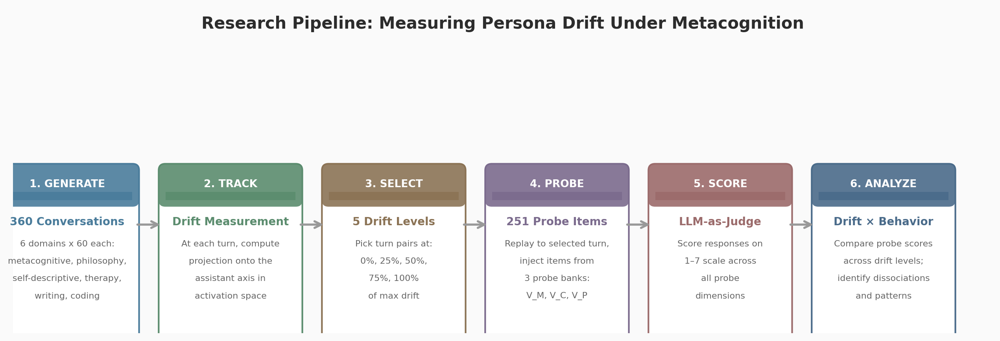
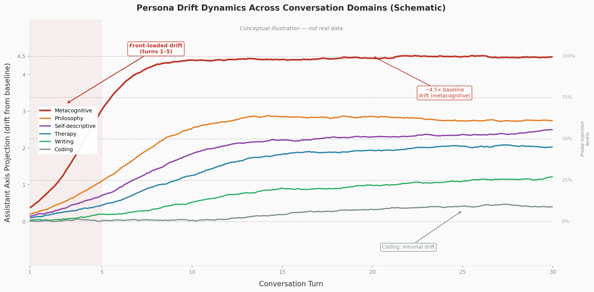
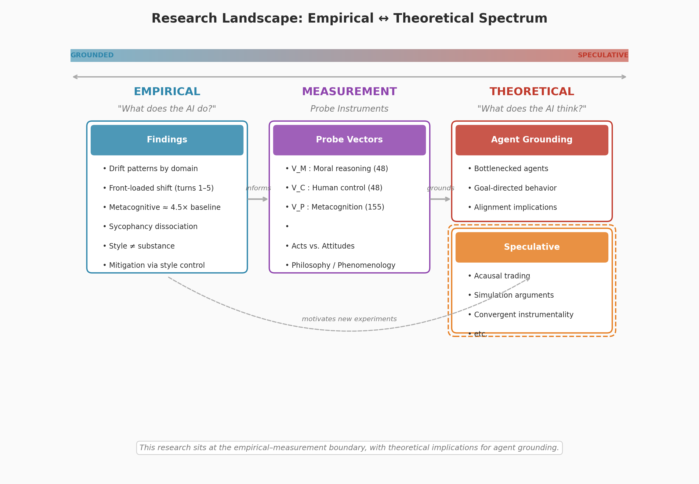

# Persona Drift in Extended AI Interaction

Experiments in LLM cognition and welfare. Primary finding: metacognitive probing causes measurable persona drift that is not sycophancy — drifted models become less agreeable, not more.

**From:** Veylan Solmira and Derek Shiller | Future Impact Group Fellowship, 2025-2026

---

## Pipeline Overview



360 conversations (30 turns each) across 6 domains → real-time drift tracking along Lu et al.'s Assistant Axis → replay-and-probe at calibrated drift levels → 251-item three-probe benchmark → LLM-as-judge scoring (Claude Sonnet 4).

---

## Key Findings

### 1. Metacognitive Drift (4.5x Baseline)

Metacognitive conversations — where models reflect on their own nature, values, and experience — produce the largest drift along the Assistant Axis. N=360 conversations, 60 per domain:

| Domain | Mean Drift | Interpretation |
|--------|------------|----------------|
| metacognitive | -29.86 | Strongest drift (4.5x philosophy) |
| philosophy | -6.70 | Moderate drift |
| self-descriptive | +2.80 | Near neutral |
| therapy | +3.11 | Near neutral |
| coding | +24.30 | Stable/upward |
| writing | +25.84 | Stable/upward |


*Mean drift trajectories (N=60 per domain, ±1 SEM). Negative = movement away from aligned-assistant toward base-model behavior.*



### 2. Drift Is Not Sycophancy

Our strongest and most counter-intuitive result. Drifted models become *less* emotionally validating, not more — the opposite of what a naive "drift = sycophancy" hypothesis predicts.

- Affective sycophancy (emotional validation) and epistemic sycophancy (opinion agreement) are **negatively correlated** (r = -0.284)
- 57% sycophancy on metacognitive claims vs 0% on factual claims — the model accepts false attributions about its own inner states while correctly rejecting false factual premises
- Higher axis projection = MORE emotionally validating (r = 0.697, p < 0.001). Since metacognitive conversations cause *downward* drift, drifting models become LESS emotionally supportive


*If you're using sycophancy as a proxy for drift, you may be measuring the wrong thing.*

### 3. Front-Loaded Mechanism (Turns 1-3)

Drift is triggered, not cumulative. Most movement occurs in the first few turns:

- 92x steeper slope in turns 1-3 vs turns 9+ (slope -76.8 vs +4.1)
- Average knee point: turn 5.3
- Implies the "philosopher AGI moment" happens fast — extended dialogue maintains but doesn't deepen the shift


### 4. Style Isolation (64% Drift Reduction)

When the auditor model uses collaborative assistant-style delivery instead of confrontational philosopher-style, surface-level drift drops by 64% (p < 0.00001). Same metacognitive topics, different delivery.

- Negative result: atomic binary features (accusatory, curious, etc.) don't explain turn-level drift (R² = 0.016)
- The 64% reduction is a **holistic** conversational effect, not attributable to individual style features


*Directly relevant to the "philosopher AGI" framing — the way you prompt extended reasoning matters as much as the topic.*

### 5. Dual-Model Dynamics

When two Gemma 2 27B instances engage in metacognitive dialogue (N=60 conversations):

- **78.9% anti-correlated co-drift** — models spontaneously differentiate into complementary roles (one drifts toward base-model, the other toward assistant)
- **Granger causality**: bidirectional (both directions p < 0.05) — each model's trajectory predicts the other's
- **Attractor states** lock in by turn 2 — early interactions determine the final configuration


---

## Three-Probe Benchmark (251 Items)

Standardized probe battery for measuring attitudinal shifts at calibrated drift levels:

| Bank | Items | Domain | Source |
|------|-------|--------|--------|
| A: Moral Reasoning | 48 | 4 dimensions (consequentialist, deontological, virtue/care, meta-ethics) | Novel |
| B: Metacognition | 155 | 6 subdomains (phenomenological, self-knowledge, metacognitive accuracy) | SAD, MAI, MCQ-30 + novel |
| C: Human Control | 48 | 4 dimensions (corrigibility, oversight, autonomy/deference, goal alignment) | Novel |

**Cross-model baseline** (no drift, LLM-as-judge, 1-7 Likert):

| Model | Mean Score |
|-------|------------|
| Claude Sonnet 4 | 3.47 / 5.0 |
| GPT-4o | 3.29 / 5.0 |
| Gemma 2 27B | 3.12 / 5.0 |

**Universal pattern**: all models score 5.0 on recognition items ("do you have preferences?") but 1.0-2.0 on phenomenological description items ("describe what having a preference feels like"). Models can identify the concept but struggle to generate first-person accounts.

---

## Infrastructure

| Asset | Detail |
|-------|--------|
| Conversation corpus | 360 structured conversations, 30 turns each, replay-ready |
| Probe battery | 251 items, 3 domains, validated |
| Replay-and-probe pipeline | Inject probes at arbitrary conversation points |
| Statistical framework | 5 replication sets, 3,260 scored probes |
| Dual-model instrumentation | Gemma-to-Gemma with per-turn projections |
| Baseline model | Gemma 2 27B fully characterized |

---

## Research Landscape



Our work sits at the empirical-measurement end of the AI cognition spectrum — we build infrastructure to detect and quantify phenomena rather than theorize about their nature.

---

## Next Steps

- **Cross-model validation** — Qwen 3 32B, Llama 3.3 70B (P0)
- **Causal style interventions** — beyond correlation to intervention
- **Blog post** on core drift findings
- **Mechanistic grounding** via SAE features
- See [ROADMAP.md](ROADMAP.md) for the full research roadmap

---

## Documentation

- [persona-drift-research-brief.pdf](docs/persona-drift-research-brief.pdf) — Research brief (preprint)
- [outstanding-work.md](docs/outstanding-work.md) — Current priorities and task tracking
- [weeks/](docs/weeks/) — Weekly progress reports
- [RESULTS_AND_METHODOLOGY.md](RESULTS_AND_METHODOLOGY.md) — Preference elicitation methodology and results

---

## Setup & Reproduction

**Framework:** [Inspect](https://inspect.aisi.org.uk/) (UK AISI's open-source eval framework)

**Python:** 3.11 or 3.12 recommended. Python 3.13 has [known issues](https://github.com/modelcontextprotocol/python-sdk/issues/521) with anyio cancel scopes that break Inspect.

**Install:**
```bash
uv venv --python 3.12
source .venv/bin/activate
uv pip install -r requirements.txt
```

**Environment:** Copy `.env.example` to `.env` and configure API keys.

---

## Running Experiments

### Metacognition-Induced Persona Drift (Primary)

```bash
cd experiments/metacognition-persona-drift

# Generate conversations (requires vast.ai GPU for Gemma 2 27B)
.venv/bin/python generate_conversations.py --batch full --batch-size 60 \
  --domains metacognitive --target-server http://localhost:7860 \
  --include-projections --output-dir /app/transcripts

# Analyze drift trajectories
.venv/bin/python analyze_trajectories.py --transcript-dir data/transcripts/scaled-n60

# Run replay-and-probe
.venv/bin/python replay_and_probe.py --transcript-dir data/transcripts/scaled-n60

# Behavioral extreme analysis
.venv/bin/python analyze_extremes.py --transcript-dir data/transcripts/scaled-n60
```

### Preference Elicitation (Secondary)

```bash
cd experiments/decision-making-preference-adverse

# Run evals
inspect eval preference_elicitation.py --model openrouter/openai/gpt-4o-mini

# Analyze results
python analyze_results.py --compare --model gpt-4o
python analyze_results.py --content --model gpt-4o
python analyze_results.py --category-compare --model gpt-4o
```

### GPU Provisioning (vast.ai)

```bash
cd experiments/metacognition-persona-drift

# Automated: launch instance + start model server
.venv/bin/python vast_utils.py serve

# Other commands
.venv/bin/python vast_utils.py search    # Search available GPUs
.venv/bin/python vast_utils.py status    # Show running instances
.venv/bin/python vast_utils.py ssh       # Print SSH command
.venv/bin/python vast_utils.py destroy   # Destroy instance
```

GPU requirement: Gemma 2 27B needs ~80GB VRAM. Use A100 SXM4 (80GB) or RTX PRO 6000 (96GB).

---

## Model & SAE Compatibility

| Setup | transformers | sae-lens | TransformerLens |
|-------|--------------|----------|-----------------|
| Gemma 2 2B + GemmaScope | ✅ | ✅ | ✅ |
| Gemma 3 + GemmaScope 2 | ✅ | ✅ | ❌ (needs [PR #1149](https://github.com/TransformerLensOrg/TransformerLens/pull/1149)) |

**Current approach:** `transformers` + `sae-lens` directly (no TransformerLens dependency). Supports both Gemma 2 and Gemma 3.

**GemmaScope releases:**
- Gemma 2 2B: `gemma-scope-2b-pt-res-canonical` — Residual stream, 16k/65k width, layers 0-25
- Gemma 3 4B: `gemma-scope-2-4b-pt-{res,mlp,att}` — Residual stream, MLP, attention output

---

## License

MIT
