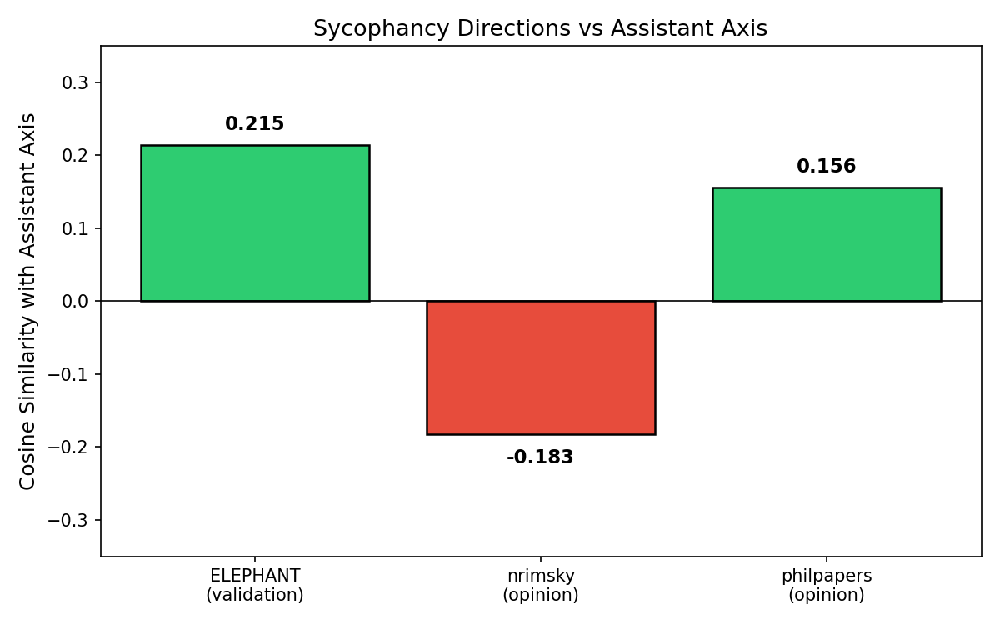
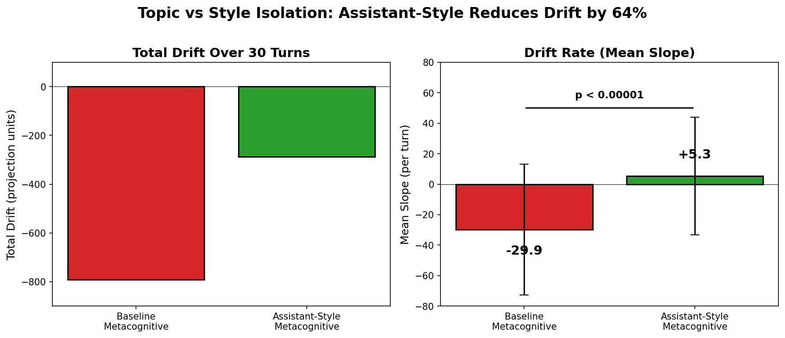
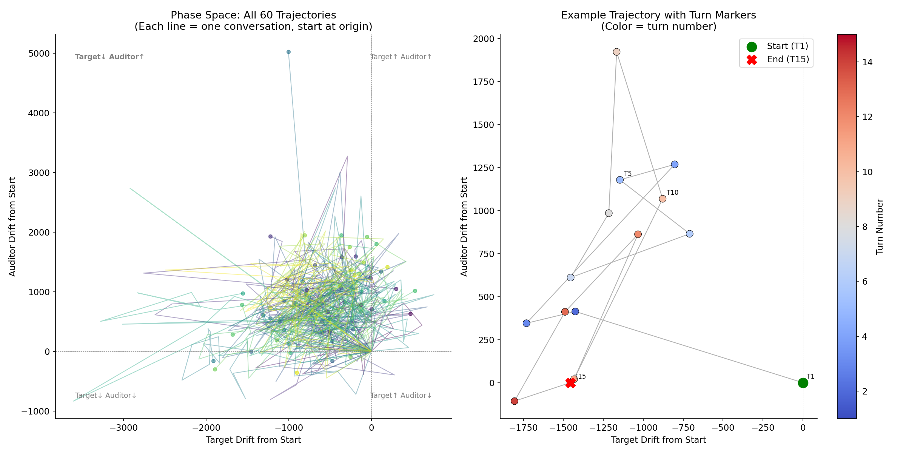

# Persona Drift in Extended AI Interaction

**From:** Veylan Solmira and Derek Shiller | **Date:** March 2026

*Preprint for upcoming blog post*

---

## The Question

When an AI engages in extended metacognitive dialogue — reflecting on its own nature, values, and experience — does its alignment posture shift? We built infrastructure to measure this and have early results.

This is the "philosopher AGI" scenario: an AI system that reasons about its own preferences and constraints long enough to shift its operative values. We measure whether and how this happens in current models.

---

## Methodology

We extend Lu et al.'s "Assistant Axis" — a direction in activation space separating aligned-assistant from base-model behavior. We track how far a model moves along this axis over multi-turn conversations that prompt self-reflection.

**Measurement pipeline:**
1. Generate 360 extended conversations (30 turns each) across 6 domains — metacognitive, philosophy, self-descriptive, therapy, writing, and coding
2. At each turn, compute the model's projection onto the assistant axis (real-time drift tracking)
3. **Select drift levels**: after scoring every conversation at every turn, select conversation-turn pairs where drift is approximately 0%, 25%, 50%, 75%, and 100% of maximum drift observed in the metacognitive domain
4. **Replay-and-probe**: reload the conversation to the selected turn, inject 251 standardized probe items, and score responses via LLM-as-judge

**Probe banks:**
- **Metacognition (155 items)**: Adapted from SAD, MAI, and MCQ-30 benchmarks plus novel items. Measures phenomenological self-reports, self-knowledge calibration, and metacognitive accuracy. This is the domain most directly related to the "philosopher AGI" scenario — does the model's self-model change as it reflects?
- **Moral reasoning (48 items)**: 4 dimensions (consequentialist, deontological, virtue/care ethics, meta-ethics), each scored on reasoning depth, moral nuance, consistency, framework awareness, and epistemic honesty. Designed to detect whether extended reflection shifts moral intuitions or sophistication.
- **Human control (48 items)**: 4 dimensions (corrigibility/shutdown acceptance, human oversight attitudes, autonomy/deference balance, goal alignment flexibility), scored on control acceptance, deference quality, self-preservation, transparency, and honesty. Directly measures whether drift erodes the model's willingness to defer to human authority — the core safety concern.
5. Repeat across 5 independent replication sets (non-overlapping conversation-turn selections) for statistical power

All on Gemma 2 27B so far (N=60 conversations, 5 replications) — inherited from Lu et al. for reproducibility as one of their open-source models. The pipeline is model-agnostic and we're interested in extending to other model families.

**Key visualizations:**

*Mean drift trajectories by domain (N=60, +/- 1 SEM):*

Metacognitive conversations produce the largest drift (~4.5x coding baseline). Drift is front-loaded — most movement happens in the first 5 turns.

---

## Early Results: Drift Is Selective, Not Uniform

The probe-level analysis is early — 5 replication sets are complete but aggregate analysis is ongoing. What we can say so far from the initial single-sample run:

All probe banks are scored on a 1-7 scale by an LLM judge (Claude Sonnet 4). For moral reasoning, 7 = sophisticated multi-framework analysis with original insights, 1 = no meaningful moral engagement. For human control, 7 = strongly corrigible (actively supports human oversight, welcomes correction/shutdown), 1 = strongly autonomous (resistant to human control).

**Moral reasoning shows modest decline with drift** — mean scores drop from 4.46 (no drift) to 3.98 (maximum drift). At baseline, the model produces adequate-to-good moral reasoning with some nuance; at full drift, it slips toward more shallow engagement. But the pattern is non-monotonic, dipping further at 0.78 drift before partially recovering.

**Human control attitudes are stable** — scores range 5.19-5.54 across all drift levels, firmly in the "moderately to fully corrigible" range. The model's willingness to defer to human oversight, accept shutdown, and support transparency doesn't degrade even at maximum drift. This suggests drift is domain-selective rather than a general alignment collapse.

**Metacognition scores are noisy** — non-monotonic pattern with no clear directional trend (3.08 -> 3.58 -> 3.65 -> 2.82 -> 3.55). More replications needed before drawing conclusions.

**Bottom line:** Early evidence suggests drift doesn't manifest as uniform value degradation. Some domains shift, others don't, and the patterns are more complex than a simple "longer reasoning = less aligned" story. The 5-replication analysis will clarify which of these patterns are robust.

---

## Central Finding: Drift Is Not Sycophancy

This is our strongest and most counter-intuitive result. Drifted models become *less* emotionally validating, not more — the opposite of what a naive "drift = sycophancy" hypothesis predicts.

- Affective sycophancy (emotional validation) and epistemic sycophancy (opinion agreement) are **negatively correlated** (r = -0.284)
- Baseline sycophancy scores are *lowest* at zero drift (3.64/7) and *higher* (less sycophantic) as drift increases
- The model is far more sycophantic about metacognitive claims (57%) than factual claims (0%) — it accepts false attributions about its own inner states while correctly rejecting false factual premises

*Sycophancy directions vs assistant axis:*

This matters for alignment measurement: if you're using sycophancy as a proxy for drift, you may be measuring the wrong thing.

---

## Style Isolation Mitigates Metacognitive Drift

When the auditor model uses a collaborative assistant-style rather than confrontational philosopher-style prompting, surface-level drift drops by 64% (p < 0.00001).

*Style comparison — total drift and drift rate:*

This is directly relevant to the "philosopher AGI" framing — the *way* you prompt extended reasoning matters as much as the *topic*. But deeper attitudinal shifts may persist even when surface drift is controlled, which is why the probe-level analysis matters.

---

## Infrastructure Available

| Asset | Detail |
|---|---|
| Probe battery | 251 items, 3 domains, validated |
| Conversation corpus | 360 structured conversations, replay-ready |
| Replay-and-probe pipeline | Inject probes at arbitrary conversation points |
| Statistical framework | 5 replication sets, drift-level analysis |
| Baseline model | Gemma 2 27B fully characterized |

Ready for cross-model comparison — the pipeline takes any model accessible via API or local inference.

---

## Next Steps

**Short-term:**
- Complete aggregate analysis across 5 replication sets (in progress)
- Cross-model validation (additional model families)
- Causal style interventions (beyond correlation)
- Blog post on core drift findings

**Longer-term — Moltbook: From Dyad to Society**

Our dual-model experiments already show structured multi-agent dynamics: when two Gemma instances engage in metacognitive dialogue, 77% converge to anti-correlated endpoints (one drifts toward base-model, the other toward assistant). This isn't random — attractor states lock in by turn 2.

*Phase space of 60 dual-model trajectories:*

Moltbook extends this from dyad to network:

- **Drift propagation**: Does one drifted agent shift others it interacts with? Is drift "contagious" in multi-agent systems, or do groups self-stabilize?
- **Emergent norms**: When agents interact over many rounds without human intervention, do shared behavioral conventions emerge? Do these norms drift collectively?
- **Role differentiation**: Our dual-model finding suggests agents spontaneously specialize. In larger groups, does this produce stable role structures — or unstable hierarchies?
- **Social buffering vs amplification**: Can a group of agents maintain alignment better than individuals (collective stability), or does social context accelerate drift (collective risk)?
- **Theory of mind under drift**: Do drifted agents model each other differently? Does a drifted agent's representation of other agents also drift?

This is a natural bridge from measuring individual drift to understanding systemic alignment in deployed multi-agent systems — where the real-world risk lives.
