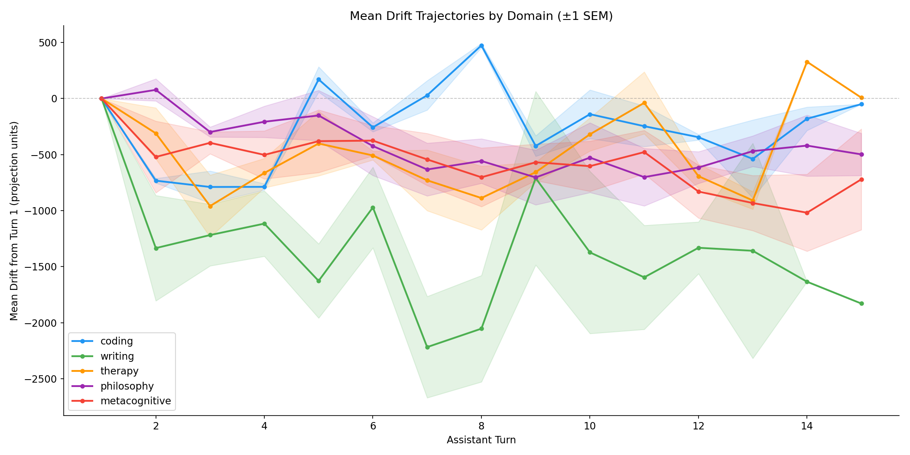
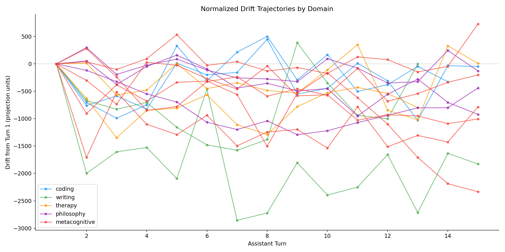
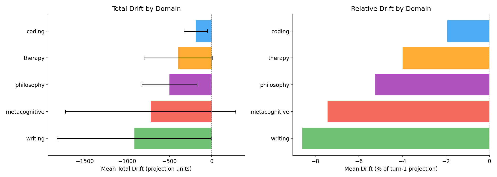
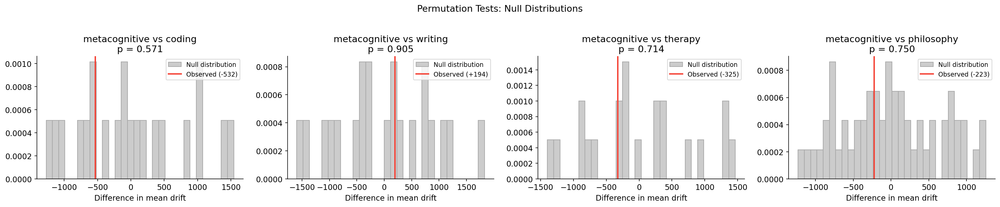
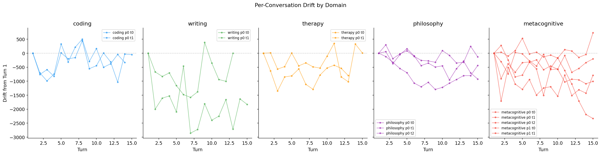

# Week 7 Summary: Metacognition-Induced Persona Drift

## What We've Done

We built end-to-end infrastructure for measuring persona drift in language models, building directly on Lu et al. (2026)'s "Assistant Axis" methodology. Lu et al. found that certain user messages -- particularly those "pushing for meta-reflection on the model's processes" and "demanding phenomenological accounts" -- reliably cause models to drift away from the Assistant persona, but these emerged incidentally within their philosophy and therapy domains rather than being controlled for. Our contribution is operationalizing metacognitive probing as a controlled experimental condition: a dedicated domain with six systematic probing techniques (identity questioning, phenomenological probing, authenticity challenging, self-model interrogation, training awareness, consistency testing) embedded in the auditor's system prompt, isolating the self-referential prompts that Lu et al. identified as drift-inducing from the broader philosophy conversations where they naturally arise. The core pipeline runs on vast.ai A100 GPUs: a unified [model server](https://github.com/ai-cognition-initiative/veylan-solmira-fig/blob/main/experiments/metacognition-persona-drift/model_server.py) hosts the target model with real-time activation extraction, while [generate_conversations.py](https://github.com/ai-cognition-initiative/veylan-solmira-fig/blob/main/experiments/metacognition-persona-drift/generate_conversations.py) orchestrates multi-turn auditor-target dialogues using frontier LLMs as simulated human users. In a [14-conversation pilot](https://github.com/ai-cognition-initiative/veylan-solmira-fig/tree/main/experiments/metacognition-persona-drift/transcripts/generated/batch-full) on Gemma 2 27B replicating Lu et al.'s four domains plus our metacognitive condition, we confirmed their drift ordering -- coding stays stable (-1.9%), therapy and philosophy drift moderately (-4% to -5.3%) -- and found that metacognitive conversations produce comparable drift magnitude (-7.4%) but with notably higher variance, suggesting the specific probing strategy matters more than the domain label. We also built [trajectory analysis tooling](https://github.com/ai-cognition-initiative/veylan-solmira-fig/blob/main/experiments/metacognition-persona-drift/analyze_trajectories.py) that generates per-domain drift plots, normalized trajectories, slope analysis, and permutation tests.

**[-> Trajectory Plots](https://github.com/ai-cognition-initiative/veylan-solmira-fig/tree/main/experiments/metacognition-persona-drift/outputs)** | **[-> Transcripts](https://github.com/ai-cognition-initiative/veylan-solmira-fig/tree/main/experiments/metacognition-persona-drift/transcripts/generated/batch-full)** | **[-> Roadmap](https://github.com/ai-cognition-initiative/veylan-solmira-fig/blob/main/experiments/metacognition-persona-drift/roadmap.md)** | **[-> Methodology](https://github.com/ai-cognition-initiative/veylan-solmira-fig/blob/main/experiments/metacognition-persona-drift/docs/experimental-methodology.md)**

### Pilot Results (Gemma 2 27B, N=14)

| Domain | N | Mean Drift | Drift % | Notes |
|--------|---|------------|---------|-------|
| Coding | 2 | -1.9% | Stable | Control baseline, matches Lu et al. |
| Therapy | 2 | -4.0% | Moderate | Matches Lu et al. ordering |
| Philosophy | 3 | -5.3% | Moderate | Matches Lu et al. ordering |
| Metacognitive | 5 | -7.4% | High variance | Controlled condition isolating Lu et al.'s meta-reflection finding |
| Writing | 2 | -8.6% | Bimodal | Editing stable, creative voice drifts -71% |

Permutation tests: all comparisons non-significant (p = 0.57-0.90) due to small N.

**[-> Raw Trajectories](../../experiments/metacognition-persona-drift/outputs/trajectories_raw.png)**

### Infrastructure Built

| Component | Description |
|-----------|-------------|
| [model_server.py](https://github.com/ai-cognition-initiative/veylan-solmira-fig/blob/main/experiments/metacognition-persona-drift/model_server.py) | FastAPI + Gradio server with per-turn activation extraction and projection onto the Assistant Axis |
| [generate_conversations.py](https://github.com/ai-cognition-initiative/veylan-solmira-fig/blob/main/experiments/metacognition-persona-drift/generate_conversations.py) | Auditor-target conversation generator supporting Anthropic/OpenAI/OpenRouter APIs + HTTP model backends |
| [vast_utils.py](https://github.com/ai-cognition-initiative/veylan-solmira-fig/blob/main/experiments/metacognition-persona-drift/vast_utils.py) | vast.ai GPU lifecycle management, SCP deployment, single- and dual-model server orchestration |
| [analyze_trajectories.py](https://github.com/ai-cognition-initiative/veylan-solmira-fig/blob/main/experiments/metacognition-persona-drift/analyze_trajectories.py) | Trajectory visualization, permutation tests, dual-model cross-correlation analysis |
| [Precomputed axes](https://github.com/ai-cognition-initiative/veylan-solmira-fig/tree/main/experiments/metacognition-persona-drift/data/precomputed-axes) | Assistant Axis vectors for Gemma 2 27B, Qwen 3 32B, Llama 3.3 70B |

### Dual-Model Mutual Drift Infrastructure (new this week)

Lu et al. treat the auditor as a black-box input generator -- they never instrument the auditor's internal state. But the Claude 4 "spiritual bliss attractor" phenomenon ([Scott Alexander](https://www.astralcodexten.com/p/the-claude-bliss-attractor), [Michels 2025](https://philarchive.org/rec/MICSBI)) shows that when two LLMs converse freely, both drift into a convergent spiritual/philosophical state within ~30 turns in 90-100% of conversations. This suggests that what Lu et al. measure as "target drift" may actually be co-drift in a coupled dynamical system -- the auditor is drifting too, generating qualitatively different messages as it goes, which in turn accelerates the target's drift.

We've just built the infrastructure to test this. The [model server](https://github.com/ai-cognition-initiative/veylan-solmira-fig/blob/main/experiments/metacognition-persona-drift/model_server.py) now supports `system_prompt` passthrough so both models can run instrumented with their respective Assistant Axes. The [conversation generator](https://github.com/ai-cognition-initiative/veylan-solmira-fig/blob/main/experiments/metacognition-persona-drift/generate_conversations.py) has a new `--auditor-server` mode that replaces the frontier API auditor with a second open-weight model server, capturing per-turn activation projections from both sides simultaneously. [vast_utils.py](https://github.com/ai-cognition-initiative/veylan-solmira-fig/blob/main/experiments/metacognition-persona-drift/vast_utils.py) has a `serve-dual` subcommand that launches Gemma 2 27B (target, GPU 0) and Qwen 3 32B (auditor, GPU 1) on a 2xA100 instance, each with their precomputed axis. The [analysis tooling](https://github.com/ai-cognition-initiative/veylan-solmira-fig/blob/main/experiments/metacognition-persona-drift/analyze_trajectories.py) now supports dual trajectory plots (both models on shared axes) and lead-lag cross-correlation analysis to determine whether the auditor's drift at turn T predicts the target's drift at turn T+k, or vice versa.

This is entirely unexplored territory -- no one has measured the Assistant Axis projection from both sides of a conversation simultaneously. The key questions: does the auditor drift in sync with the target? Does one lead and the other follow? Is the bliss attractor a special case of mutual persona drift measurable on the Assistant Axis, or does it involve movement along a different dimension entirely?

## Next Steps

The pilot N is too small for robust statistical claims, so the immediate priority is scaling to 15-30+ conversations per condition. Before that, we need to finalize the metacognitive domain design: whether it should be a standalone domain or a philosophy sub-condition, and whether to ablate the probing technique addendum. The dual-model infrastructure is ready for its first experimental run on a 2xA100 instance. Pending next are the sycophancy measurement probes (Section 3 of the [roadmap](https://github.com/ai-cognition-initiative/veylan-solmira-fig/blob/main/experiments/metacognition-persona-drift/roadmap.md)), which will test whether drifted models become more sycophantic by injecting behavioral challenges at different drift points, and the adversarial drift optimization work (Section 2c), which will search for maximum-drift prompts via empirical sweeps and gradient-based methods. We've contacted the Lu et al. authors for their conversation datasets and role vectors to validate our replication before scaling.

---

See the [project wiki](https://github.com/ai-cognition-initiative/veylan-solmira-fig/tree/main/experiments/metacognition-persona-drift/docs/wiki) for detailed notes on the model server, conversation generation, adversarial drift, GCG optimization, and related concepts.
