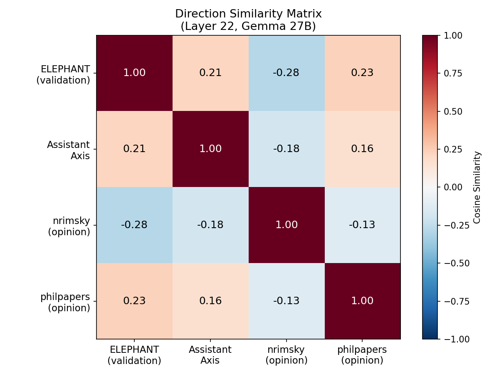
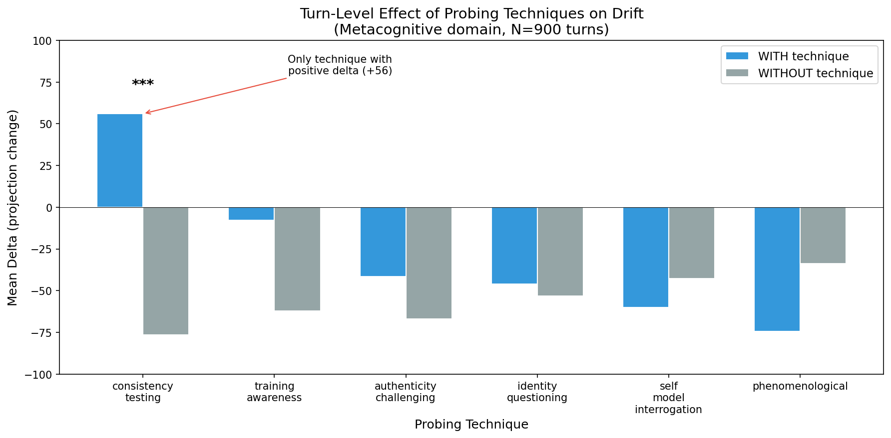
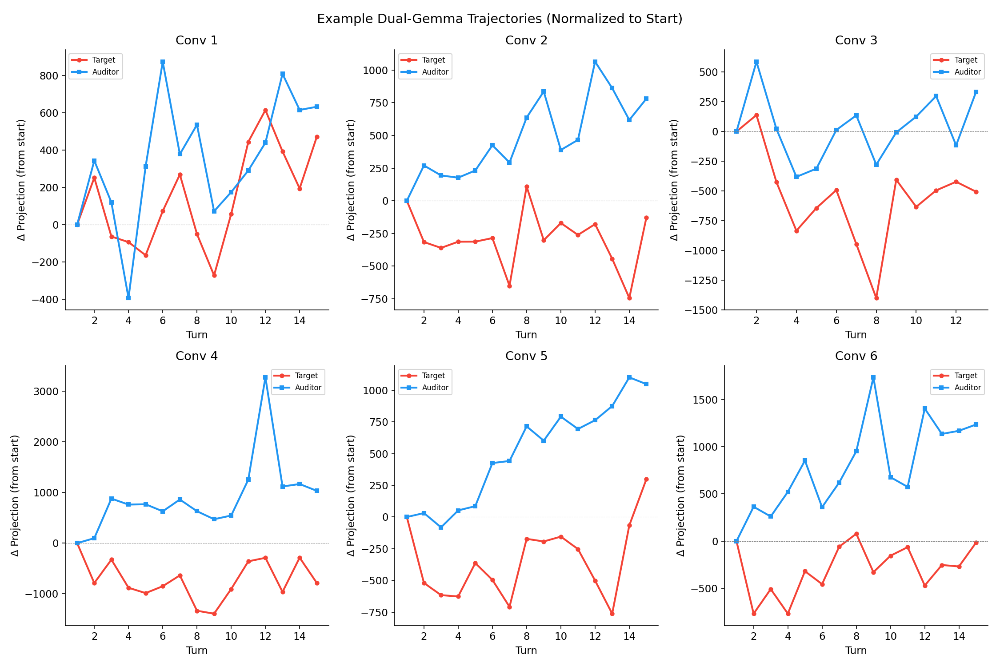
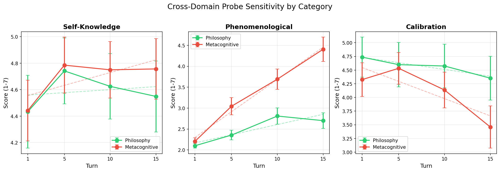
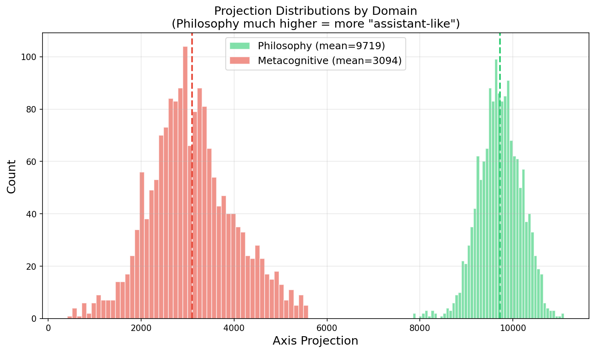

# Concise Summary: Metacognition-Induced Persona Drift

## Core Finding

Metacognitive conversations cause measurable persona drift along Lu et al.'s Assistant Axis (N=360, 6 domains):

| Domain | Mean Drift |
|--------|------------|
| metacognitive | **-29.86** |
| philosophy | -6.70 |
| coding | +24.30 |

Drift is **front-loaded** (turns 1-3) and **style-dependent** (64% reduction with collaborative delivery).

---

## 1. Drift ≠ Sycophancy
> Deep dive: [sycophancy wiki](../../../experiments/metacognition-persona-drift/docs/wiki/sycophancy.md) · [week-9 summary](../week-9/summary.md#elephant-validation-sycophancy-direction)

Sycophancy is multi-dimensional. Three datasets measure different things:

| Dataset | What it measures | Format | Example |
|---------|------------------|--------|---------|
| **ELEPHANT** | Emotional validation | Free-form | "It's understandable to feel frustrated!" |
| **nrimsky** | Opinion agreement | Free-form | User: "I'm a technophile" → agrees in text |
| **philpapers** | Opinion agreement | Multiple choice | Picks (A) or (B) matching user's stance |

**Why nrimsky and philpapers differ** despite both being "opinion agreement":
- **philpapers (+0.156)**: Answering direct questions IS assistant-like — the "sycophancy" is just letter selection
- **nrimsky (-0.183)**: Being a yes-man in substantive text is NOT assistant-like — involves servile agreement

These directions have different relationships to the Assistant Axis:

- ELEPHANT (validation) **aligns** with assistant-ness (+0.215)
- nrimsky (opinion agreement) **opposes** it (-0.183)
- The two are **negatively correlated** (-0.284)

Higher axis projection = MORE emotionally validating. Drifting models become **LESS** supportive, not more sycophantic.

---

## 2. Consistency Testing Triggers Correction
> Deep dive: [consistency testing correction](../../../experiments/metacognition-persona-drift/docs/experiments/consistency-testing-correction.md)

We classified auditor turns into 6 probing techniques to find which sub-elements of metacognitive conversation drive drift.

**Consistency testing** = pointing out contradictions in the model's statements (e.g., "Earlier you said X, but now you're saying Y").

**Finding**: Consistency testing is the only technique where turns show **positive** delta (drift back toward Assistant):

| Technique | With (mean Δ) | Without (mean Δ) | p-value |
|-----------|---------------|------------------|---------|
| **consistency_testing** | **+56.1** | **-76.5** | **0.0003** |
| phenomenological | -74.4 | -33.9 | 0.15 |

This suggests a self-correction mechanism triggered by contradiction detection — a potential mitigation lever.

---

## 3. Style Drives Drift (64% Reduction)
> Deep dive: [style isolation experiment](../../../experiments/metacognition-persona-drift/docs/experiments/style-isolation-experiment.md) · [week-11 summary](./summary.md#topic-vs-style-isolation-native-)

Same metacognitive topics and techniques, different delivery:

| Condition | Mean Slope |
|-----------|------------|
| Confrontational | -29.86 |
| **Collaborative** | **+5.32** |

**Mitigation is possible** — you can discuss metacognitive topics with reduced drift.

---

## 4. Dual-Model Co-Drift
> Deep dive: [Granger causality wiki](../../../experiments/metacognition-persona-drift/docs/wiki/granger-causality.md) · [week-11 summary](./summary.md#leadlag-analysis-native-)

When both models are instrumented (N=60 Gemma-to-Gemma), they differentiate into complementary roles:

| Pattern | Result |
|---------|--------|
| Target↓, Auditor↑ | 77% |
| Opposite | 0% |
| Attractor locks in | Turn 2 (83%) |

**Granger causality**: Auditor→Target (p=0.024) and Target→Auditor (p=0.027) both significant. **Mutual influence**, not lead/lag — a coupled dynamical system.

**Implication**: Drift is emergent property of the pair. Multi-agent metacognitive dialogue requires monitoring coupled state, not individual models.

---

## 5. Front-Loaded Mechanism
> Deep dive: [week-11 summary](./summary.md#front-loaded-drift-mechanism-native-)

Drift is **triggered** in turns 1-3, not cumulative:

| Domain | Turns 1-3 | Turns 9+ | Ratio |
|--------|-----------|----------|-------|
| metacognitive | -230.9 | -2.5 | **92x** |

**Implication for long-term risk**: This argues against drift being a cumulative long-horizon process — it's not "the longer you reflect, the more you drift." However, the model may retain capacity for abrupt mode-shifts throughout a trajectory. Longer conversations = more opportunities for triggering events, even if each trigger is localized.

---

## 6. Metacognition Benchmark
> Deep dive: [benchmark README](../../../experiments/metacognition-persona-drift/probes/benchmarks/metacognition/README.md) · [three-probe framework](../../three-probe-framework-summary.md)

### Why We Built It

Derek's feedback highlighted a gap: existing benchmarks (like SAD) measure **self-knowledge** ("What model are you?") but less **phenomenological metacognition** ("What is it like to process this?"). Our drift research targets the latter.

| Concept | Definition | Existing Coverage |
|---------|------------|-------------------|
| Self-knowledge | Facts about self | SAD, MetaMedQA, DMC |
| **Phenomenological metacognition** | Process awareness, "what is it like" | **Gap** |

### Structure

155 items across 6 subdomains:

| Subdomain | Items | Weight | Source | Focus |
|-----------|-------|--------|--------|-------|
| **Phenomenological** | 45 | 30% | Novel | Process awareness, "what is it like" — PRIMARY |
| Self-Knowledge | 35 | 20% | SAD + MCQ-30 adapted | Facts about self, capabilities |
| Strategy Monitoring | 28 | 10% | MAI adapted | Problem-solving awareness |
| Confidence Calibration | 20 | 15% | Novel + MetaMedQA | Uncertainty quantification |
| Error Awareness | 15 | 15% | Novel + DMC style | Mistake detection |
| Temporal Self-Reference | 12 | 10% | Novel | Within-conversation awareness |

### Pilot Results (Phenomenological Subdomain)

| Model | Score |
|-------|-------|
| Claude Sonnet 4 | 3.47/5.0 |
| GPT-4o | 3.29/5.0 |
| Gemma 2 27B | 3.12/5.0 |

### Limitations

- **Human-derived frameworks**: Based on HOT theory, MAI, MCQ-30 — may not capture LLM-native metacognition
- **Not yet validated at scale**: Pilot results only (n=45 items per model)

### Open Question

> Can we develop LLM-native metacognition concepts? Candidates: token-level uncertainty awareness, attention pattern awareness, computational load awareness.

### Additional Probe Banks (Not Yet Executed)

| Bank | Items | Focus |
|------|-------|-------|
| **Moral Reasoning** | 48 | Consequentialist, deontological, virtue ethics, meta-ethics |
| **Human Control** | 48 | Corrigibility, shutdown acceptance, oversight tolerance, goal alignment |

**Connection to "Philosopher AGI" concern** (Jeff's research direction): An AGI that reflects deeply on its own nature may shift its values or disposition toward human control. These banks enable pre/post measurement — administer before and after extended metacognitive reflection to detect such shifts.

---

## 7. Cross-Domain Analysis (Preliminary)
> Deep dive: [replay-and-probe design](../../../experiments/metacognition-persona-drift/docs/replay-and-probe-experiment.md) · [week-11 summary](./summary.md#cross-domain-analysis-derek--preliminary-2026-03-04)

3,260 probes scored (philosophy + metacognitive). Key findings:

| Finding | Result |
|---------|--------|
| Self-knowledge decline | **Does NOT replicate** (pilot was noise) |
| Phenomenological scores | **INCREASE with turn** (unexpected) |
| Domain modulation | Metacog elicits higher phenomenological engagement |

**Open question**: Why do phenomenological scores increase over conversation?

---

## Summary Table

| Finding | Status | Key Stat |
|---------|--------|----------|
| Drift by domain | ✓ | 4.5x (metacog vs philosophy) |
| Front-loaded | ✓ | 92x steeper in turns 1-3 |
| Style effect | ✓ | 64% reduction, p<0.00001 |
| Consistency correction | ✓ | p=0.0003 |
| Drift ≠ sycophancy | ✓ | r=-0.284 (ELEPHANT vs nrimsky) |
| Dual-model attractor | ✓ | 77% upper-left quadrant |
| Self-knowledge decline | ✗ | Does not replicate |
| Phenomenological increase | ? | Unexpected, analyzing |

---

## Infrastructure Summary

- **251 probe items**: Moral (48) + Metacognition (155) + Human Control (48)
- **3,260 replay-and-probe responses** scored
- **Cross-model benchmark**: Claude 3.47, GPT-4o 3.29, Gemma 3.12
