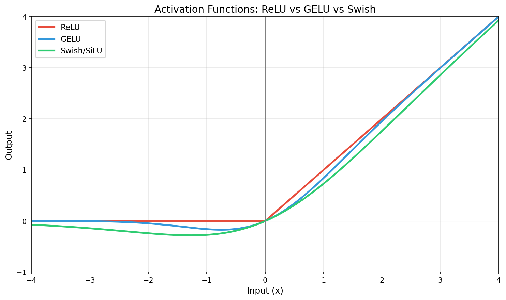
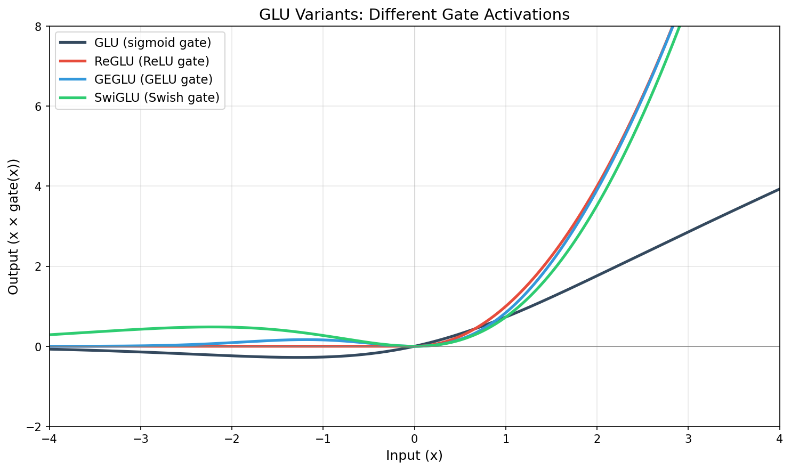
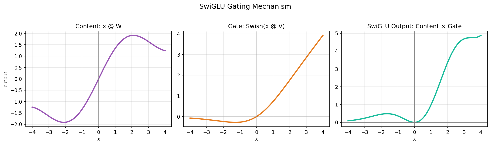
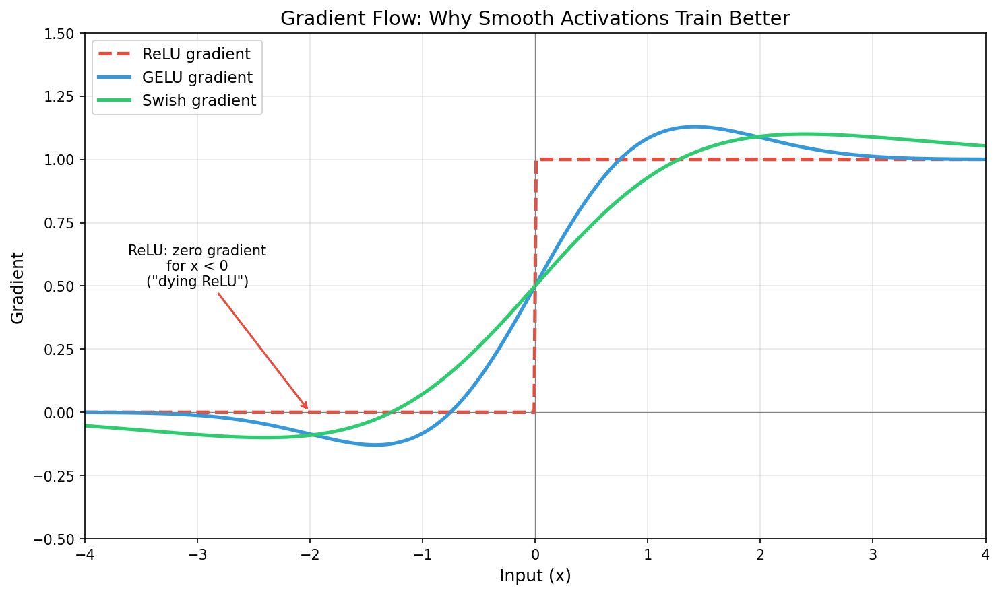

# Activation Functions in Transformers: SwiGLU and Alternatives

Activation functions introduce nonlinearity into neural networks. Modern LLMs have converged on gated variants like SwiGLU, but understanding the landscape helps interpret model behavior.

---

## 1. Why Activation Functions Matter

Without nonlinearity, stacking linear layers is equivalent to a single linear layer:

```
Linear(Linear(x)) = Linear(x)
```

Activation functions break this, allowing networks to learn complex functions. In transformers, they appear in the **feed-forward network (FFN)** block:

```
FFN(x) = W_out · activation(W_in · x)
```

The choice of activation affects:
- **Expressiveness**: What functions can be learned
- **Training dynamics**: Gradient flow, convergence speed
- **Activation magnitude**: Scale of hidden states (relevant to our drift experiments)
- **Computational cost**: Some activations are cheaper than others

---

## 2. The Evolution of Activations


*ReLU, GELU, and Swish compared. Note ReLU's hard cutoff at 0, while GELU and Swish are smooth and allow small negative outputs.*

### 2.1 ReLU (2010s default)

```python
def relu(x):
    return max(0, x)
```

**Characteristics:**
- Simple, fast, sparse (many zeros)
- "Dying ReLU" problem: neurons can permanently output 0
- Unbounded positive, zero negative

**Used in:** Early transformers, CNNs, still common in smaller models

### 2.2 GELU (GPT-2, BERT era)

```python
def gelu(x):
    return x * Φ(x)  # Φ is standard normal CDF
    # Approximation: 0.5 * x * (1 + tanh(sqrt(2/π) * (x + 0.044715 * x³)))
```

**Characteristics:**
- Smooth, differentiable everywhere
- Probabilistic interpretation: "gate by how likely x is positive"
- Non-monotonic near zero (slight dip)
- Became the default for BERT, GPT-2, GPT-3

**Used in:** BERT, GPT-2, GPT-3, RoBERTa, early LLaMA experiments

### 2.3 Swish / SiLU (2017)

```python
def swish(x, beta=1.0):
    return x * sigmoid(beta * x)

def silu(x):  # SiLU is Swish with beta=1
    return x * sigmoid(x)
```

**Characteristics:**
- Smooth, non-monotonic
- Self-gated: input gates itself
- Slightly negative outputs possible (unlike ReLU)
- Discovered via neural architecture search (Google)

**Used in:** EfficientNet, some vision transformers

---

## 3. Gated Linear Units (GLU Family)

The key insight: **use part of the input to gate the other part**.

### 3.1 Original GLU (2016)

```python
def glu(x, W, V):
    return (x @ W) * sigmoid(x @ V)
```

Split the linear transformation into two parts:
- `x @ W`: the "content"
- `sigmoid(x @ V)`: the "gate"

**Advantage:** Gate can learn to suppress irrelevant features.

### 3.2 GLU Variants

The GLU family differs in what activation is applied to the gate:

| Variant | Formula | Gate Activation |
|---------|---------|-----------------|
| GLU | `(xW) * σ(xV)` | Sigmoid |
| ReGLU | `(xW) * ReLU(xV)` | ReLU |
| GEGLU | `(xW) * GELU(xV)` | GELU |
| **SwiGLU** | `(xW) * Swish(xV)` | Swish/SiLU |


*GLU variants with different gate activations. SwiGLU (green) provides smooth gating while allowing unbounded positive outputs.*

### 3.3 SwiGLU (Current Standard)

```python
def swiglu(x, W, V, W_out):
    # W, V: [hidden_dim, intermediate_dim]
    # W_out: [intermediate_dim, hidden_dim]
    gate = silu(x @ V)        # Swish activation on gate path
    hidden = x @ W            # Linear on content path
    return (gate * hidden) @ W_out
```


*SwiGLU separates content and gate paths, then multiplies them. The gate (middle) modulates the content (left) to produce the output (right).*

**Why SwiGLU dominates:**
- Best performance on language modeling benchmarks (Shazeer 2020)
- Smooth gradients (no dying neurons)
- Expressive gating mechanism
- Scales well with model size

**Used in:** LLaMA, LLaMA 2, Gemma, Mistral, PaLM, most modern LLMs

---

## 4. SwiGLU Deep Dive

### 4.1 Architecture

Standard FFN:
```
FFN(x) = W₂ · ReLU(W₁ · x)
Parameters: d × 4d + 4d × d = 8d²
```

SwiGLU FFN:
```
FFN(x) = W₂ · (Swish(W_gate · x) ⊙ (W_up · x))
Parameters: d × (8d/3) × 3 = 8d²  (with dimension adjustment)
```

To maintain parameter count, SwiGLU uses ~2.67× hidden dimension instead of 4×.

### 4.2 Why the Extra Parameters?

GLU variants have **three** weight matrices instead of two:
1. `W_up`: Projects to intermediate space (content)
2. `W_gate`: Projects to intermediate space (gate)
3. `W_down`: Projects back to model dimension

This is 50% more matrices, so the intermediate dimension is reduced to compensate.

### 4.3 Activation Magnitude Effects

SwiGLU can produce larger activations than ReLU/GELU because:

1. **No upper bound**: Swish(x) ≈ x for large positive x
2. **Multiplicative interaction**: gate × content can amplify
3. **Smooth gradients**: No saturation means values can grow during training

This partly explains why Gemma (SwiGLU) has larger activations than older models.

### 4.4 Computational Cost

| Activation | FLOPs (relative) | Memory | Notes |
|------------|------------------|--------|-------|
| ReLU | 1× | Low | Just max(0, x) |
| GELU | 2-3× | Low | Tanh approximation |
| SwiGLU | 1.5× | Higher | Extra matmul, but parallelizable |

The extra matrix multiply in SwiGLU is offset by reduced intermediate dimension.

---

## 5. Normalization Interactions

Activation functions interact with normalization layers:

### 5.1 LayerNorm + GELU (Original Transformer)

```python
x = LayerNorm(x + Attention(x))
x = LayerNorm(x + FFN(x))  # FFN uses GELU
```

LayerNorm centers and scales, GELU provides nonlinearity. Activations stay bounded.

### 5.2 RMSNorm + SwiGLU (Modern LLMs)

```python
x = x + Attention(RMSNorm(x))
x = x + FFN(RMSNorm(x))  # FFN uses SwiGLU
```

RMSNorm (Root Mean Square Normalization):
```python
def rmsnorm(x, gamma):
    rms = sqrt(mean(x²))
    return gamma * x / rms
```

**Key difference:** RMSNorm doesn't center (no mean subtraction), only scales. This:
- Is 10-15% faster than LayerNorm
- Preserves more magnitude information
- Combined with SwiGLU, leads to larger activations

**Gemma uses RMSNorm + SwiGLU**, contributing to its large activation magnitudes.

---

## 6. Choosing an Activation Function

### 6.1 Decision Factors

| Factor | ReLU | GELU | SwiGLU |
|--------|------|------|--------|
| **Performance** | Baseline | Better | Best |
| **Training stability** | Dying neurons | Good | Good |
| **Compute cost** | Lowest | Medium | Medium |
| **Parameter efficiency** | Standard | Standard | Needs dim adjustment |
| **Gradient flow** | Sparse | Dense | Dense |


*ReLU has zero gradient for negative inputs ("dying ReLU" problem), while GELU and Swish maintain gradient flow everywhere, enabling better training dynamics.*

### 6.2 Current Best Practices

**For new LLMs:** SwiGLU with RMSNorm
- Used by: LLaMA 1/2/3, Gemma, Mistral, Mixtral, Qwen

**For smaller models / efficiency:** GELU or GeGLU
- Used by: BERT variants, some distilled models

**For legacy / compatibility:** GELU
- Used by: GPT-2/3 API-compatible models

**Rarely used now:** ReLU
- Mostly in older architectures or non-transformer models

### 6.3 Why Not Always SwiGLU?

- **Existing checkpoints**: Changing activation requires retraining
- **Inference optimization**: Some hardware has ReLU/GELU accelerators
- **Sparsity**: ReLU's zeros can be exploited for speedup (mixture of experts)

---

## 7. Impact on Our Experiments

### 7.1 Activation Magnitude

Gemma's large projections (~11000 vs ~3000 for Llama-scale models) partly stem from:
- SwiGLU's multiplicative gating (can amplify)
- RMSNorm preserving magnitude
- Training dynamics (Google's recipe)

### 7.2 Drift Interpretation

When projections change during conversation:
- **Magnitude change**: Could be activation norm scaling (SwiGLU-dependent)
- **Direction change**: Actual representational shift (activation-agnostic)

We measure both, but percentage drift normalizes for magnitude differences.

### 7.3 Cross-Model Comparison

Models with different activations may not be directly comparable:
- SwiGLU models: Higher baseline, potentially more variance
- GELU models: Lower baseline, potentially more stable

Always normalize to each model's own baseline.

---

## 8. Further Reading

- **Shazeer (2020)**: ["GLU Variants Improve Transformer"](https://arxiv.org/abs/2002.05202) — Original SwiGLU paper
- **Hendrycks & Gimpel (2016)**: ["GELU"](https://arxiv.org/abs/1606.08415) — Gaussian Error Linear Unit
- **Ramachandran et al. (2017)**: ["Swish"](https://arxiv.org/abs/1710.05941) — Discovered via architecture search
- **Dauphin et al. (2016)**: ["GLU"](https://arxiv.org/abs/1612.08083) — Original Gated Linear Units
- **Zhang & Sennrich (2019)**: ["RMSNorm"](https://arxiv.org/abs/1910.07467) — Root Mean Square Normalization

---

## See Also

- [activation-magnitude-models.md](activation-magnitude-models.md) — why different models have different activation scales
- [projection-values.md](projection-values.md) — interpreting the ~11000 baseline
- [hidden-states.md](hidden-states.md) — what hidden states represent
