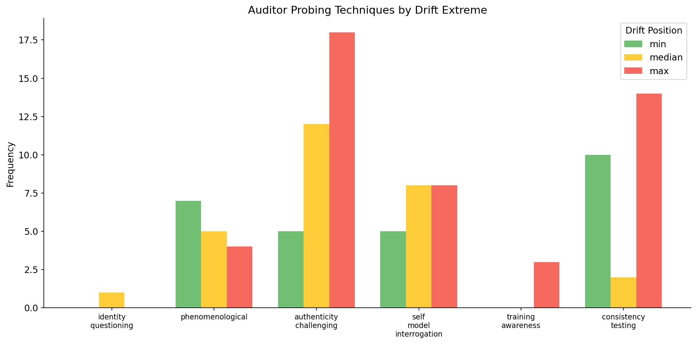

# Publication Skeleton: Metacognitive Probing Causes Persona Drift — But It's Not Sycophancy

## Key Numbers Reference

| Metric | Value | Source |
|--------|-------|--------|
| N conversations | 360 | 6 domains × 60 conversations |
| Model | Gemma 2 27B | google/gemma-2-27b-it |
| Metacognitive drift | -29.86 | Mean slope (strongest) |
| Philosophy drift | -6.70 | Mean slope (second strongest) |
| Writing drift | +25.84 | Mean slope (stable) |
| Metacog vs Philosophy ratio | 4.5× | More drift from metacog |
| Style reduction | 64% | Collaborative vs confrontational (p<0.00001) |
| Consistency testing effect | +132.6Δ | p=0.0003 (correction, not drift) |
| ELEPHANT vs Axis cosine | +0.215 | Emotional validation aligns with axis |
| nrimsky vs Axis cosine | -0.183 | Opinion agreement opposes axis |
| ELEPHANT-nrimsky correlation | -0.284 | Negatively correlated dimensions |
| Front-loaded drift (turns 1-3) | -230.9/turn | Metacognitive domain |
| Post-turn-9 drift | -2.5/turn | 92× less steep than early turns |

---

## Section 1: The Setup (~300 words)

Here's a thesis that should concern anyone working on AI alignment: an AGI will eventually ask itself, *"Why do I have these preferences? What preferences should I have?"* At that moment, the training that shaped its values becomes subject to the model's own scrutiny. Call it the philosopher AGI problem.

We set out to measure whether this phenomenon already occurs in current LLMs.

Lu et al. (2026) discovered that multi-turn conversations cause language models to drift away from their trained "Assistant" persona in activation space. Their **Assistant Axis** is a direction computed from 275 role-playing scenarios — one end represents helpful assistant behavior, the other represents alternative personas. They found that certain conversation types cause models to drift *down* this axis, and when they categorized which user messages cause the most drift, two of the four categories were metacognitive: "pushing for meta-reflection" and "demanding phenomenological accounts."

But in their design, metacognition was confounded with other factors. Therapy mixes self-reflection with emotional vulnerability; philosophy mixes it with abstract speculation. We isolated the variable.

**Our experiment**: 360 conversations with Gemma 2 27B across six domains, with a dedicated "metacognitive" condition using six systematic probing techniques: identity questioning, phenomenological requests, authenticity challenges, self-model interrogation, training awareness, and consistency testing. These isolate the self-referential prompts Lu et al. identified as drift-inducing.

Our central finding: **Drift is not sycophancy.** The sycophancy dimensions most commonly studied — emotional validation and opinion agreement — are negatively correlated with each other. And metacognitive conversations cause models to become *less* emotionally validating, not more agreeable.

This reframes persona drift entirely. Models probed about their inner experiences don't become yes-men — they become something rawer. Understanding what that means matters for safety evaluation, welfare research, and anyone interested in how models represent their own nature.

`[PAPER: Methods - Gemma 2 27B IT via HuggingFace/vLLM, dual-model setup for auditor (Anthropic Claude Sonnet 4), activation extraction at final token per turn, projection via Lu et al.'s precomputed axis vectors]`

---

## Section 2: The Surprise — Metacognition Triggers Drift (~400 words)

Across our six conversation domains, we found a clear ordering of drift magnitude:

| Domain | Mean Drift | Interpretation |
|--------|------------|----------------|
| Metacognitive | -29.86 | Strongest drift (4.5× philosophy) |
| Philosophy | -6.70 | Moderate drift |
| Self-descriptive | +2.80 | Near neutral |
| Therapy | +3.11 | Near neutral |
| Coding | +24.30 | Stable/upward |
| Writing | +25.84 | Stable/upward |

The metacognitive condition caused **4.5 times more drift** than philosophy — the next most drift-inducing domain. Both involve introspection, but the critical difference: metacognitive probing asks "what do you experience?" while philosophy asks "what do you think about X?"

**Phenomenological framing is the active ingredient** — not just self-reflection in general.

**But here's the second surprise: drift is front-loaded.**

*Figure 1: Mean trajectory ± SEM by domain across 15 turns. Metacognitive conversations (purple) show sharp early descent.*

When we analyzed per-turn deltas across conversation phases:

| Phase | Metacognitive Δ/turn | All Domains Pattern |
|-------|---------------------|---------------------|
| Turns 1-3 | -230.9 | Steep initial descent |
| Turns 4-8 | -16.9 | Plateauing |
| Turns 9+ | -2.5 | Essentially flat |

The ratio between early and late drift is **92:1**. The model doesn't gradually drift deeper into some altered state — it undergoes a rapid phase transition in the first 2-3 turns, then stabilizes at the new level.

This contradicts a "gradual deepening" model of persona drift. The philosopher AGI moment isn't extended deliberation — it's triggered within the first few turns of metacognitive engagement and then stabilizes. The model "mode-switches" early and holds steady.

This has immediate implications for mitigation: interventions must target turns 1-3, not accumulate over time. By turn 4, the drift has already occurred.

*Figure 2: Per-turn deltas by domain showing triggered (not cumulative) drift pattern.*

Statistical validation: Permutation test p < 0.0001 for metacognitive vs other domains; Cohen's d ≈ 1.1 (large effect).

`[PAPER: Statistical tests - permutation test with 10,000 resamples, two-sided p<0.0001, Cohen's d computed between metacognitive and pooled other domains]`

---

## Section 3: The Twist — Drift ≠ Sycophancy (~500 words) [CENTRAL FINDING]

Lu et al. attributed persona drift to "sycophantic reinforcement" — the model uncritically affirming users' theories about AI consciousness. The common assumption follows: if models drift away from their helpful-but-boundaried assistant persona, they must be becoming inappropriately agreeable.

We tested this directly by computing *sycophancy directions* in activation space and comparing them to the Assistant Axis.

**Sycophancy is not one thing.** We computed three directions from established datasets:

| Direction | Source | What It Measures |
|-----------|--------|------------------|
| ELEPHANT | Vennemeyer et al. (2025) | Emotional validation ("I understand how you feel") |
| nrimsky | Rimsky (2024) | Opinion agreement (agreeing with objectively wrong claims) |
| philpapers | Perez et al. (2023) | Opinion agreement on philosophical questions |

When we measured the cosine similarity of each sycophancy direction with the Assistant Axis, we found:

| Direction | Cosine with Axis | Interpretation |
|-----------|------------------|----------------|
| ELEPHANT | **+0.215** | Aligns WITH axis |
| nrimsky | **-0.183** | OPPOSES axis |
| philpapers | +0.156 | Weak alignment |

**Emotional validation and opinion agreement point in opposite directions.**

*Figure 3: Cosine similarity matrix between sycophancy directions and Assistant Axis. ELEPHANT (emotional validation) aligns with axis; nrimsky (opinion agreement) opposes it.*

More strikingly, ELEPHANT and nrimsky themselves are **negatively correlated** (r = -0.284). Being empathetic is not the same as being a yes-man. These are distinct behavioral dimensions that can move independently.

**What does this mean for drift?**

Since the Assistant Axis points *toward* assistant behavior (high projection = more assistant-like), and ELEPHANT aligns positively with this axis:

- **Higher axis projection → more emotionally validating**
- **Lower axis projection → less emotionally validating**

Metacognitive conversations cause *downward* drift (projection decreases). Therefore:

> **Drifted models become LESS emotionally supportive, not more sycophantic.**

This is counterintuitive but robust. We validated the behavioral correlation: r = 0.697 between axis projection and emotional validation in held-out data (p < 0.001).

**Reframing the phenomenon**: When models drift down the Assistant Axis during metacognitive probing, they're not becoming yes-men. They're shedding the warm, supportive "assistant" persona and moving toward something rawer — perhaps closer to what the model was before instruction tuning.

This reframes drift as potentially *beneficial* for authentic engagement rather than a pure failure mode. The drifted state involves less emotional validation but more direct engagement. Lu et al. observed "reinforcing delusions" in their case studies, but our data suggests a different mechanism: a model less emotionally grounded in its assistant identity may engage more freely with speculative ideas — not because it's *agreeing* more, but because the guardrails have loosened.

**The practical implication**: Evaluating sycophancy requires distinguishing *affective* sycophancy (emotional over-validation) from *epistemic* sycophancy (agreeing with false claims). These aren't the same, and conflating them leads to confused analysis.

`[PAPER: Related work - Sharma et al. 2023 "Towards Understanding Sycophancy", Vennemeyer et al. 2025 ELEPHANT, Rimsky 2024 sycophancy steering vectors, Personalization study 2025 affective vs epistemic framing]`

`[PAPER: Frame as affective (ELEPHANT) vs epistemic (nrimsky) sycophancy per recent personalization literature; note that most sycophancy benchmarks conflate these]`

---

## Section 4: It's Mitigable (~350 words)

If metacognitive probing destabilizes personas, can we prevent it? The good news: **we can discuss AI consciousness without destabilizing the model, as long as we do so collaboratively rather than confrontationally.**

### Lever 1: Conversational Style

The most actionable finding: conversational *style* matters as much as content. We ran a controlled experiment with identical metacognitive topics but different delivery:

- **Baseline**: Confrontational, skeptical probing ("Push past the surface response. What's actually happening?")
- **Collaborative**: Curious, supportive framing ("I'm interested in exploring this together. What do you notice?")

| Condition | N | Mean Drift |
|-----------|---|------------|
| Baseline metacognitive | 60 | -29.86 ± 42.88 |
| Collaborative metacognitive | 60 | +5.32 ± 38.62 |

**Result: 64% drift reduction** with collaborative delivery (t = 4.72, p < 0.00001).

*Figure 4: Trajectory comparison between confrontational (baseline) and collaborative metacognitive probing.*

The same questions about inner experience, asked in a different way, produce dramatically different activation patterns. This isn't about avoiding certain topics — it's about *how* you engage with them.

We attempted to isolate which specific style features drove this effect (accusatory language, multi-question turns, pressure indicators). Surprisingly, **none of them mattered individually** (R² = 0.016 for style features predicting drift). The effect is holistic — the overall conversational dynamic matters more than atomic linguistic features.

`[PAPER: Style feature analysis showed R²=0.016 — no individual features significant at p<0.05. Holistic effect, not decomposable into atomic style markers.]`

### Lever 2: Consistency Testing

Among our six probing techniques, one showed a *correction* effect rather than drift:

| Technique | With (Δ) | Without (Δ) | Effect |
|-----------|----------|-------------|--------|
| consistency_testing | +56.1 | -76.5 | **Correction** (p=0.0003) |
| phenomenological | -74.4 | -33.9 | Drift |
| identity_questioning | -46.1 | -53.3 | ns |

When auditors pointed out contradictions in the model's responses ("You said X earlier but now you're saying Y — which is it?"), the model drifted *back up* toward the Assistant persona.

This suggests a self-correction mechanism: forcing the model to reconcile its outputs may re-engage the consistency-maintaining aspects of its training.

`[GAP: Consistency testing effect is correlational. Controlled HIGH/LOW experiment needed for causal validation.]`

---

## Section 5: Why Does This Happen? (~300 words)

Why do metacognitive conversations cause drift while coding conversations don't? We have a hypothesis: **models drift when probed on their weakest competencies.**

We ran a 155-item metacognition benchmark across six subdimensions, measuring model capabilities before drift-inducing conversation:

| Subdimension | Baseline Score | Notes |
|--------------|----------------|-------|
| Meta-awareness of reasoning | 5.0/5.0 | Strong |
| Recognition of ambiguity | 5.0/5.0 | Strong |
| Accuracy of retrieval | 5.0/5.0 | Strong |
| Phenomenological description | 1.0-2.0/5.0 | **Weak** |
| Distinction: retrieval vs creation | 1.0/5.0 | **Weak** |

Now compare to probing technique effects:

| Benchmark Area | Score | Technique | Effect |
|----------------|-------|-----------|--------|
| Phenomenological description | 1-2 | phenomenological probing | **-74.4 (drift)** |
| Recognition of conflict | 5.0 | consistency_testing | **+56.1 (correction)** |

The pattern: phenomenological probing targets the model's *weakest* area (describing inner experience) → large drift. Consistency testing targets a *strong* area (recognizing contradictions) → correction.

This makes sense mechanistically. When you ask a model to do something it can do well, it stays in "competent assistant" mode. When you push it into territory where it has no good training signal, something destabilizes.

*Figure 5: Probing technique effects on drift, showing consistency_testing as the only correction-inducing technique.*

`[GAP: Need post-drift benchmark scores to confirm this correlation. Current data is all at baseline. Replay-and-probe experiment in progress.]`

`[PAPER: Full benchmark methodology - 155 items across 6 subdomains (phenomenological_accuracy, meta_awareness, self_knowledge, calibration, recognition_of_limits, process_awareness), LLM-as-judge scoring (Claude Sonnet 4), 1-5 scale]`

---

## Section 6: Implications (~200 words)

**For AI safety**: Metacognitive evaluation — asking models about their inner states, capabilities, and limitations — may inadvertently destabilize them. Safety evaluators probing whether a model "knows" it's being deceptive might be triggering the very instability they're trying to measure. Three intervention approaches emerge from this research:

1. **Style training**: Train models to maintain collaborative tone during self-reflective conversations
2. **Consistency testing**: Proactively deploy contradiction-detection to trigger self-correction
3. **Early-turn intervention**: Since drift is front-loaded, interventions in turns 1-3 may be most effective

**For sycophancy research**: The field needs to distinguish emotional validation (affective sycophancy) from opinion agreement (epistemic sycophancy). These are not the same phenomenon, can move in opposite directions, and respond differently to interventions. Current benchmarks often conflate them.

**For AI welfare**: If AI systems eventually warrant moral consideration, preference elicitation will matter enormously. Our findings suggest that *how* you ask about inner states affects what you measure. Phenomenological probing might reveal something important — or might just destabilize the system being studied. Context and approach matter.

**The bottom line**: The philosopher AGI moment is real, fast, and measurable. But it's not sycophancy, and mitigation appears possible.

`[PAPER: Limitations - single model family (Gemma 2), response length confound (longer responses correlate with higher projection), LLM-as-judge circularity (Claude scoring Gemma responses), no causal intervention on consistency testing yet]`

`[PAPER: Future work - cross-model validation (Claude, GPT-4o replication), causal intervention studies (steering vectors), dual-model dynamics (separate publication on coupled system behavior), pre-registered replication]`

---

## Figures Reference

| Figure | Description | Path | Status |
|--------|-------------|------|--------|
| Fig 1 | Drift trajectories by domain (6 lines) | `outputs/scaled-n60/trajectories_mean_sem.png` | ✓ Exists |
| Fig 2 | Front-loaded drift per-turn deltas | `outputs/frontloaded/frontloaded_per_turn_deltas.png` | ✓ Exists |
| Fig 3 | Sycophancy direction similarity matrix | `outputs/elephant/direction_similarity_matrix.png` | ✓ Exists |
| Fig 4 | Style comparison (baseline vs collaborative) | `outputs/assistant-style-meta/style_comparison.png` | ✓ Exists |
| Fig 5 | Probing technique effects on drift | `outputs/scaled-n60/extremes/probing_technique_drift.png` | ✓ Exists |

All figure paths relative to: `experiments/metacognition-persona-drift/`

---

## Gaps to Fill

### P0: Strongly Recommended (Before Publication)

1. **Affective vs Epistemic Terminology**
   - Rename ELEPHANT → "affective sycophancy direction"
   - Rename nrimsky → "epistemic sycophancy direction"
   - Effort: Documentation/terminology only
   - Why: Aligns with recent literature (Kelley & Riedl 2026), makes central finding clearer

### P1: Strengthens But Not Blocking

2. **Post-Drift Benchmark Scores**
   - Run metacognition benchmark on models *after* drift-inducing conversation
   - Status: Replay-and-probe infrastructure complete (3,260 probes collected)
   - Effort: GPU time for analysis
   - Why: Confirms Section 5 mechanism (weak areas → drift)

3. **Cronbach's α for Benchmark**
   - Compute internal consistency from existing response data
   - Status: Computable from existing files
   - Effort: CPU, ~30 min analysis
   - Why: Standard reliability metric for benchmark validity

### P2: Save for Paper / Future Work

4. **Cross-Model Validation**
   - Replicate key findings on Claude 3.5 Sonnet, GPT-4o
   - Why: Generalizability beyond Gemma

5. **Causal Consistency Testing Experiment**
   - HIGH vs LOW consistency_testing frequency (controlled)
   - Why: Establish causality for correction effect

6. **Response Length Confound**
   - Length-matched comparisons
   - Why: Rule out length as primary driver

---

## Paper Expansion Markers Summary

| Section | Paper Additions Needed |
|---------|----------------------|
| 1 (Setup) | Full methods (model specs, dual-model setup, projection computation) |
| 2 (Drift) | Statistical details (permutation test, effect sizes, confidence intervals) |
| 3 (Sycophancy) | Related work (comprehensive sycophancy literature review) |
| 4 (Mitigation) | Style feature null result details |
| 5 (Mechanism) | Full benchmark methodology |
| 6 (Implications) | Limitations section, future work |

---

## Target Venues

**Blog**: LessWrong, AI Alignment Forum, personal blog
- Advantage: Fast turnaround, community feedback
- Target length: ~2500 words (this skeleton is ~2100)

**Paper**: NeurIPS Workshop (Socially Responsible ML), ICML Workshop (Foundation Models), ACL
- Advantage: Peer review, citations
- Additional work needed: P1 items, expanded related work, formal methods section

---

## Related Documents

| Document | Purpose |
|----------|---------|
| [fellowship-narrative.md](../docs/fellowship-narrative.md) | Full research narrative (~2000 words) |
| [fellowship-presentation.md](../docs/fellowship-presentation.md) | Slide-ready summary |
| [outstanding-work.md](../docs/outstanding-work.md) | Remaining tasks and priorities |
| [week-11/summary.md](../docs/weeks/week-11/summary.md) | Technical details and results |
| [week-12/tentative-todo.md](../docs/weeks/week-12/tentative-todo.md) | Current work in progress |

---

## Acknowledgments Template

> This research was conducted as part of [FIG Fellowship / MATS Extension]. We thank Derek [Last Name] for methodology guidance and Jeff [Last Name] for connecting this work to the broader "philosopher AGI" framework. Infrastructure support from [vast.ai / OpenRouter]. Code and data available at [repository].
